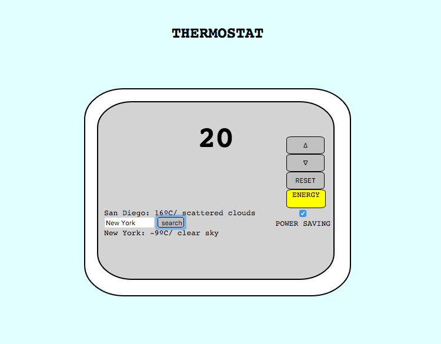

# Thermostat



Getting started
----
```
$ git clone git@github.com:jongmin141215/thermostat_express.git
$ cd thermostat_express
$ npm install experss --save
$ node app.js
```
Visit http://localhost:3000

Running tests
----
```
$ open SpecRunner.html
```

Features
----
* Thermostat starts at 20 degrees
* You can increase the temperature with the up button
* You can decrease the temperature with the down button
* The minimum temperature is 10 degrees
* If power saving mode is on, the maximum temperature is 25 degrees
* If power saving mode is off, the maximum temperature is 32 degrees
* Power saving mode is on by default
* You can reset the temperature to 20 by hitting the reset button
* The thermostat should colour the display based on energy usage - < 18 is green, < 25 is yellow, otherwise red

Technologies
----
* Server: Express
* Language: JavaScript
* Testing: Jasmine
* Styling: Bootstrap
